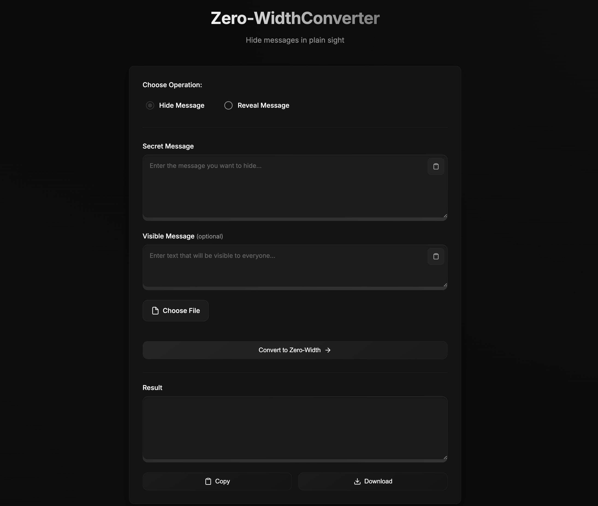

# Zero-Width Text Converter

A sleek, modern web application that allows you to hide secret messages within normal text using zero-width characters. Perfect for sharing hidden messages in plain sight.

DEMO HERE:  https://prince77-7.github.io/text-zero-width/

## Features

- **Message Hiding**: Embed secret messages within normal text using zero-width characters
- **Message Revealing**: Extract hidden messages from text containing zero-width characters
- **Optional Visible Message**: Include visible text to make the message appear natural
- **File Support**: Upload and download files for both encoding and decoding
- **Modern Dark Theme**: Easy on the eyes with a sophisticated dark interface
- **Mobile Responsive**: Works seamlessly on all devices
- **Quick Paste**: Convenient paste buttons for all input fields
- **Copy & Download**: Easy sharing with copy and download options for results

## How It Works

### Hiding a Message
1. Select "Hide Message" mode
2. Enter your secret message
3. (Optional) Add visible text that others will see
4. Click "Convert" to generate the encoded text
5. Copy or download the result

### Revealing a Message
1. Select "Reveal Message" mode
2. Paste text containing hidden content
3. Click "Extract" to reveal the hidden message
4. View the decoded secret message

## Technical Details

The application uses a two-step conversion process:

1. **Text to Hex**: First, the input text is converted to hexadecimal, where each character becomes a two-digit hex value.
   - For example, "A" becomes "41", "B" becomes "42", etc.

2. **Hex to Zero-Width**: Then, each hexadecimal digit (0-9 and a-f) is mapped to a unique zero-width character:

   | Hex | Unicode | Character Name | Description |
   |-----|---------|---------------|-------------|
   | 0 | `\u200B` | ZERO WIDTH SPACE | Acts as an invisible space |
   | 1 | `\u200C` | ZERO WIDTH NON-JOINER | Prevents joining behavior |
   | 2 | `\u200D` | ZERO WIDTH JOINER | Forces joining behavior |
   | 3 | `\u200E` | LEFT-TO-RIGHT MARK | Controls text direction |
   | 4 | `\u200F` | RIGHT-TO-LEFT MARK | Controls text direction |
   | 5 | `\uFEFF` | ZERO WIDTH NO-BREAK SPACE | Prevents line breaks |
   | 6 | `\u2060` | WORD JOINER | Prevents line breaks |
   | 7 | `\u2061` | FUNCTION APPLICATION | Mathematical invisible character |
   | 8 | `\u2062` | INVISIBLE TIMES | Mathematical multiplication |
   | 9 | `\u2063` | INVISIBLE SEPARATOR | Mathematical separator |
   | a | `\u2064` | INVISIBLE PLUS | Mathematical addition |
   | b | `\u206A` | INHIBIT SYMMETRIC SWAPPING | Controls character mirroring |
   | c | `\u206B` | ACTIVATE SYMMETRIC SWAPPING | Controls character mirroring |
   | d | `\u206C` | INHIBIT ARABIC FORM SHAPING | Controls Arabic presentation |
   | e | `\u206D` | ACTIVATE ARABIC FORM SHAPING | Controls Arabic presentation |
   | f | `\u206E` | NATIONAL DIGIT SHAPES | Controls digit presentation |

This means each original character becomes two zero-width characters in the final output. For example:
- Letter "A" (hex 41) becomes `\u200F\u200C` (RTL MARK + ZWNJ)
- Letter "B" (hex 42) becomes `\u200F\u200D` (RTL MARK + ZWJ)
- Letter "!" (hex 21) becomes `\u200D\u200C` (ZWJ + ZWNJ)

The process is reversed when decoding:
1. Zero-width characters are mapped back to hex digits using the reverse mapping
2. Hex values are converted back to regular text

## Usage

Simply open `index.html` in a modern web browser. No installation or dependencies required.

## Security Note

While this method can hide messages from casual observation, it should not be considered secure encryption. The hidden messages can be detected by anyone who knows to look for zero-width characters.

## Browser Support

Works on all modern browsers that support:
- ES6+ JavaScript
- Modern CSS features
- Clipboard API
- File API

## License

MIT License - Feel free to use, modify, and distribute as needed.

## Contributing

Feel free to open issues or submit pull requests if you have suggestions for improvements!
